# Triangulos_FP

## Sobre la compilación

Si estás en 1ero, probablemente uses un IDE xd, así que te puedes saltar este paso.  

Si no, haciendo: `g++ -o "ejecutable" "fichero.cpp"` generamos el ejecutable del fichero deseado

## Descripción de los ficheros:

(Todos los ejemplos se prueban con altura = 10)

[`ejemplo1.cpp`](ejemplo1.cpp): colección de los 10 triángulos más básicos, incluye pirámides y pirámides invertidas.

 
 
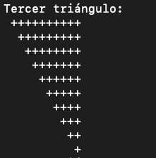 
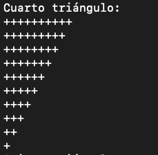 
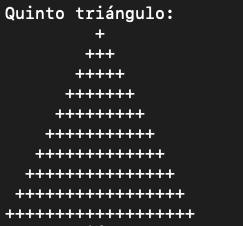 
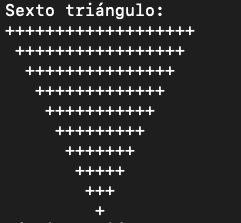 
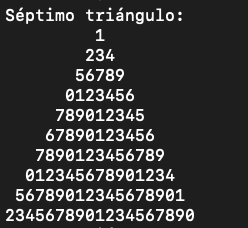 
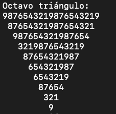 
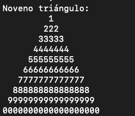 
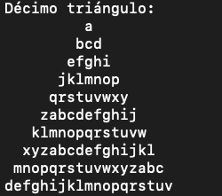  

[`ejemplo2.cpp`](ejemplo2.cpp)  

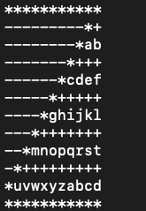  

[`ejemplo3.cpp`](ejemplo3.cpp)  

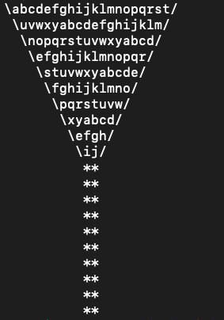  

[`ejemplo4.cpp`](ejemplo4.cpp)  

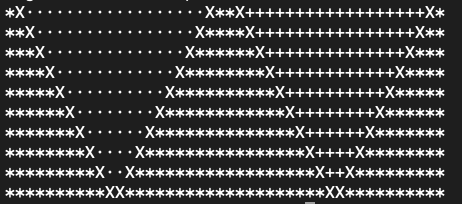 

[`ejemplo5.cpp`](ejemplo5.cpp)  

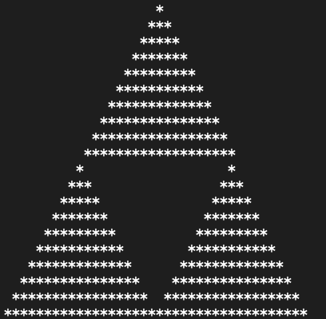 

[`ejemplo6.cpp`](ejemplo6.cpp)  

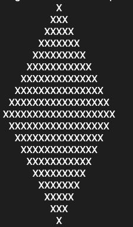  

[`ejemplo7.cpp`](ejemplo7.cpp)  

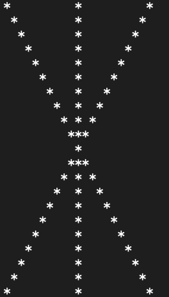 

[`ejemplo8.cpp`](ejemplo8.cpp)  

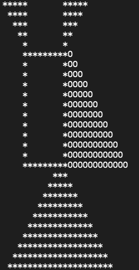 

[`ejemplo9.cpp`](ejemplo9.cpp)  

 

