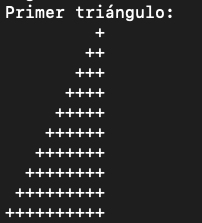
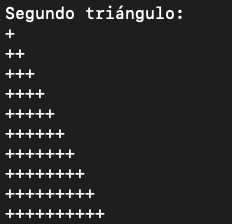

# Triangulos_FP

## Sobre la compilación

Si estás en 1ero, probablemente uses un IDE xd, así que te puedes saltar este paso.  

Si no, haciendo: `g++ -o "ejecutable" "fichero.cpp"` generamos el ejecutable del fichero deseado

## Descripción de los ficheros:

[`ejemplo1.cpp`](ejemplo1.cpp): colección de los 10 triángulos más básicos, incluye pirámides y pirámides invertidas.

 
 

